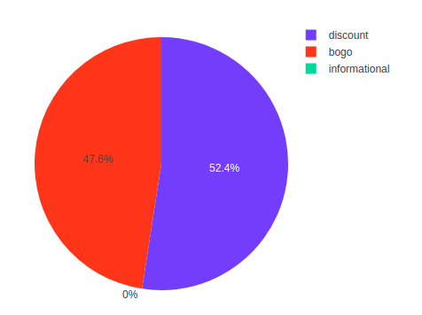
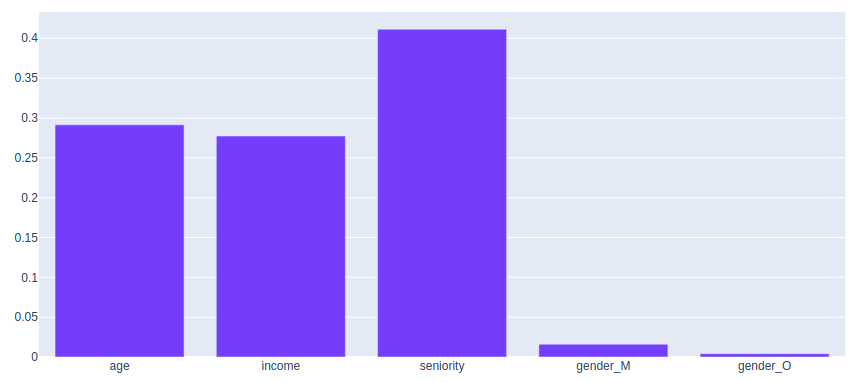

# Starbucks_Offers
Analysis to determine what is the best offer to send to Starbucks' consumers

## Description

This project consists in predicting the right offer to the Starbucks app member.

The steps of this projects were:
- explore data: understand what were the offers that led to transaction and who where the person using them intentionaly
- process the data : given 3 dataset, merge the person and offer valuable infos and transform them so that they can be used in a classification model
- train a mutliclass classification model: given a member (age, income, seniority, gender) predict the offer that is more likely to lead him to conversion
- apply this model to any member to find out what offer would suit him best

The dataset we use only focuses on the transcactions that has been led by an offer.
We can see that among this dataset, we have the same amount of BOGO and discount offers.

Let's not that the performances of the model (assessed with the f1-score) are quite poor. Still, the use case does not require top predictions. Furthermore, we prefered here focusing on the way to lead the analysis rather than getting the highest performances.

The model that performed the best was a Random Forest Classifier. Looking at feature importance we can see that income is the one with the highest impact.

In order to go through the exploration analysis through the notebook, please visit the associated html file.

As a data cleaning is done through out this notebook, we thought it would be convenient to clean and transform the data via the process_data script you can run in the command line with
`python process_data.py`

The full study can be found on this [Medium blog posts](https://medium.com/@hadi75/send-the-right-offer-to-starbucks-consumers-87334714c35d).

## Installation

The notebook is using Python 3.6

You will need to install:
- pandas and numpy
- plotly
- pickle
- sklearn and xgboost

## Further work on the data and the model

### Try adding the no offer information
As we could have seen in the data exploration, there are interesting information about the person that don't complete the offers.
We could add them in the dataset of analysis but it would imply dealing with unbalanced class to keep predicting all the possibilities.

### Fine tuning the model
As the predictions have quite a low performance, we could try and have a more complexe approach by tailoring the offer for each member. We would then predict the characteristics of the offer depending on the member.

### Testing new approaches
We could try and deduce the offer from the transaction amount the person is used to spend in order to advise this person the offer that would be easy completing and increase the loyalty.

## Sources
- [Medium article on how to put a table in Medium](https://medium.com/@hussachai/creating-a-table-in-medium-1ecf924af08e)
- [Why use SVM](https://community.alteryx.com/t5/Data-Science-Blog/Why-use-SVM/ba-p/138440)
- [Scaling the data for Random Forest](https://stackoverflow.com/questions/8961586/do-i-need-to-normalize-or-scale-data-for-randomforest-r-package)
- [Pros and Cons of Random Forest](https://towardsdatascience.com/random-forest-classification-and-its-implementation-d5d840dbead0)
- [Grid Search for Random Forest](https://www.kaggle.com/sociopath00/random-forest-using-gridsearchcv)
- [Grid Search for XGBoost](https://www.mikulskibartosz.name/xgboost-hyperparameter-tuning-in-python-using-grid-search/)

Thank you to Udacity for the material of the Nanodegree program which helped me putting this all together!
